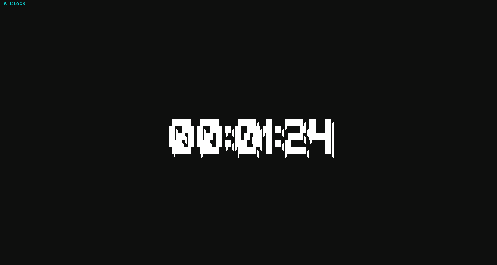

# ASCII CLOCK

ASCII-CLOCK is a little project for me to learn a new tui framework in rust.
The goal is a feature full clock cli-application which I can use for
presentations and other stuff like a pomodoro timer.

And this is my app...

 

## Contributions are always welcome

- if you have a new feature idea feel free to open a new issue
- if you find a bug do the same
- PRs are also very welcome
- if you see some code that has bad style also let me know, I am eager to learn
